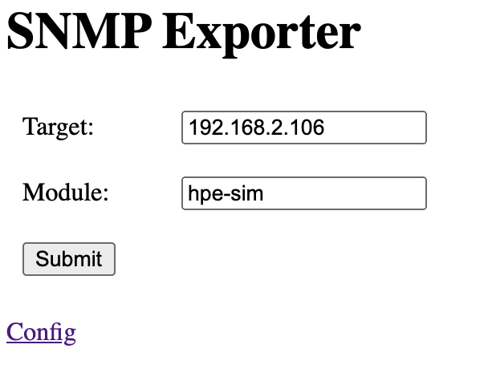
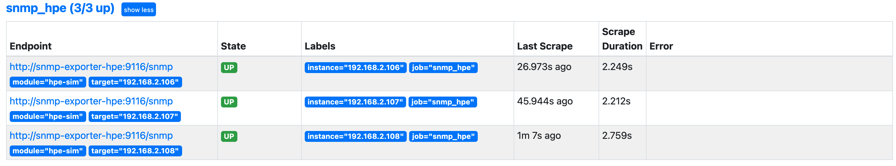

# Prometheus SNMP Exporter for HPE Products

Configurations of Promehteus SNMP exporter for
HPE Product. No need to use SNMP exporter generator for creating snmp.yml. These configurations are based on mibs bundled in HPE SIM.  

|  HPE SIM Version  |  MIB Kit Version  |
| :---: | :---: |
|  HPE SIM 7.6 Hotfix Oct-2020  |  [11.50](https://support.hpe.com/hpsc/swd/public/detail?swItemId=MTX-0741569cd81544c78f02136736)  |
|  HPE SIM 7.6 Limited Release 5  |  [11.40](https://support.hpe.com/hpsc/swd/public/detail?swItemId=MTX-aaf94a5dd38d42dda86fc083d8)  |
|  HPE SIM 7.6 Hotfix Oct-2019  |  [11.35](https://support.hpe.com/hpsc/swd/public/detail?swItemId=MTX-53293d026fb147958b223069b6)  |
|  HPE SIM 7.6 Limited Release 4  |  [11.30](https://support.hpe.com/hpsc/swd/public/detail?swItemId=MTX-c06c7ce759924d38a33b7023bf)  |

You can see more details of HPE SIM [here](https://support.hpe.com/hpesc/public/docDisplay?docId=emr_na-c04272529).  
SNMP-Exporter details are [here](https://github.com/prometheus/snmp_exporter).  
Sample scraping data is [here](docs/sample_outpu_data.txt).

## Docker Images
You can get images from [Dockerhub](https://hub.docker.com/r/fideltak/snmp-exporter-hpe).

## SNMPv3 Authentification
These configurations for SNMPv3. The default auth parameters are below as you can see bottom of each snmp.yml.

```
  auth:
    security_level: authPriv
    username: prometheus
    password: password
    auth_protocol: SHA
    priv_protocol: AES
    priv_password: password
```

Don't forget to create SANMP user in iLO before using this. 

## Kubernetes
You can use [sample manifest](k8s-sample.yml).  
Note: This manifest is including *Ingress*, you need change ingress controller name which you are using or remove that section.  

You can not create *ConfigMap* object for snmp-exporter by using *snmp.yml* since *snmp.yml* is too large. Therefore please use [docker images](https://hub.docker.com/r/fideltak/snmp-exporter-hpe).

After deploying snmp-exporter, you can scrape data from exporter GUI. Target will be iLO address.  


And you have to set some prameters into *prometheus.yml*.  
The module name is *hpe-sim*.
You can get more details to setup snmp-exporter from [here](https://github.com/prometheus/snmp_exporter).

```
  prometheus.yml: |
    scrape_configs:
    - job_name: snmp_hpe
      static_configs:
        - targets:
          - 192.168.2.106
          - 192.168.2.107
          - 192.168.2.108
      metrics_path: /snmp
      params:
        module: [hpe-sim]
      relabel_configs:
      - source_labels: [__address__]
        target_label: __param_target
      - source_labels: [__param_target]
        target_label: instance
      - target_label: __address__
        replacement: snmp-exporter-hpe:9116
```

Don't forget to check the exporter status is healthy.


